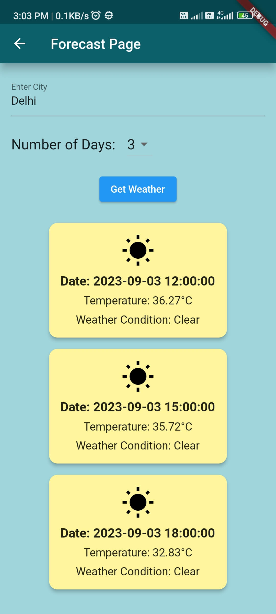
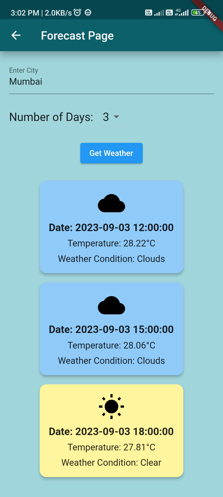
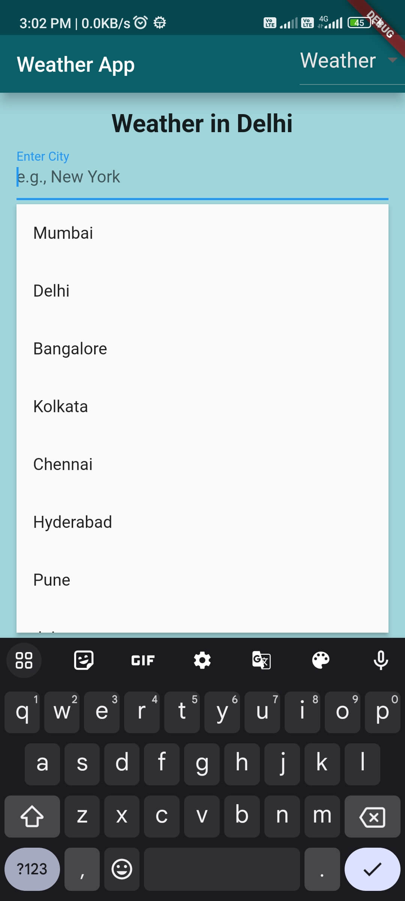

# Flutter Weather App

A simple weather app built with Flutter that allows users to check the current weather conditions for a specific location using the OpenWeather API.

## Features

- View the current weather conditions, including temperature, humidity, wind speed, and more.
- Search for weather information by city name or location coordinates.
- Display weather icons and descriptions to represent the weather conditions.
- Save and view a list of favorite locations for quick access to weather data.

## Screenshots

<div style="display: flex; justify-content: space-between;">
  
  
  
  
</div>


## Getting Started

Follow these steps to set up and run the Flutter Weather App on your local machine.

### Prerequisites

- Flutter SDK: [Installation Guide](https://flutter.dev/docs/get-started/install)
- OpenWeather API Key: [Sign Up](https://openweathermap.org/appid) to obtain an API key.

### Installation

1. Clone this repository:

   ```bash
   git clone https://github.com/ABHISHEKKUMAR89207/WeatherApp.git
2. Flutter package
   ```bash
   flutter pub get
if not work use this code flutter packgae paste it on terminla
 ```bash
   flutter pub add lottie
   flutter pub add flutter_typeahead
   dart pub add http
